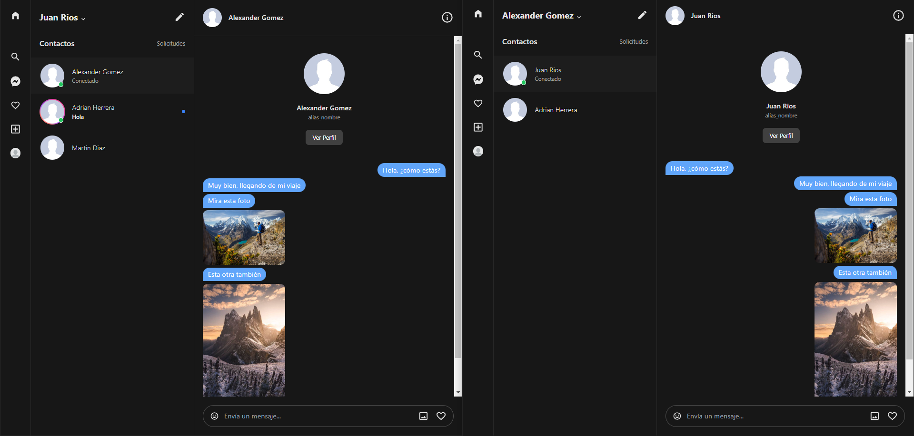
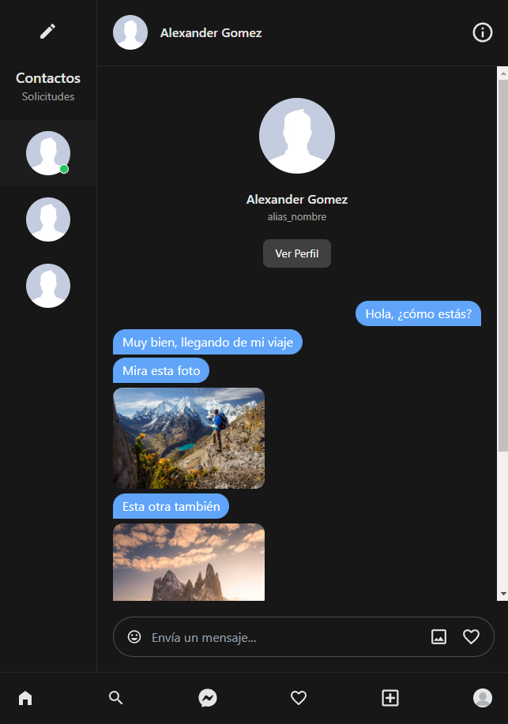
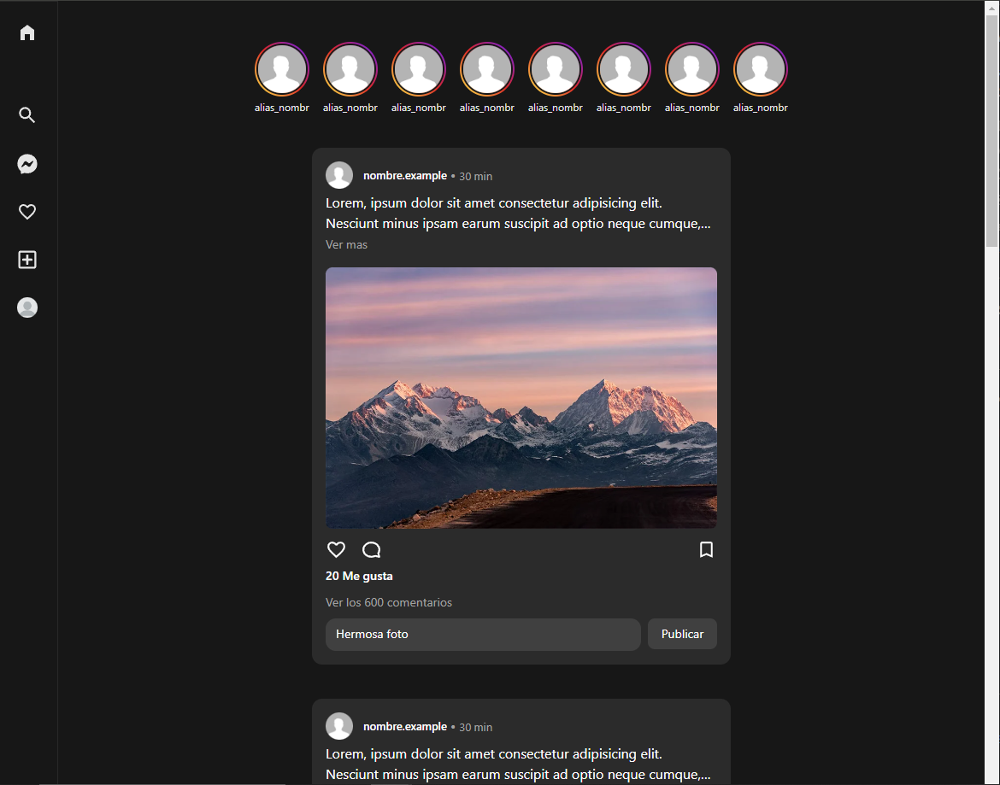
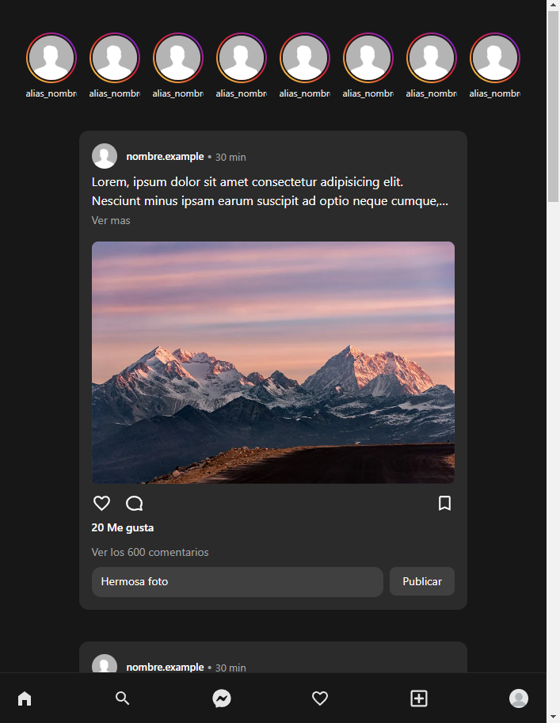

# Realtime chat app - En curso

Por el momento, el proyecto se encuentra en etapa de desarrollo, no existe una fecha límite para tener una demo, ya que hay otros aspectos que investigar antes de lanzar la aplicación.
Es importante mencionar que el código no será público.

## Dependecias

- Laravel 10
- Laravel WebSocket
- Laravel Echo
- Inertia JS
- React v18
- React Icons
- React Query
- Tailwind CSS

## Chat privado

## Chat privado responsivo

## Home

## Home responsivo

